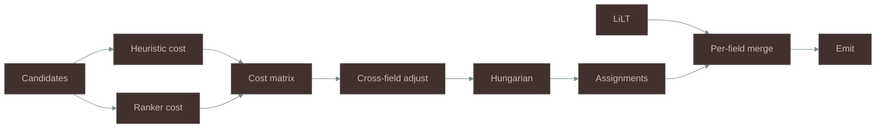
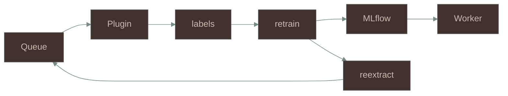
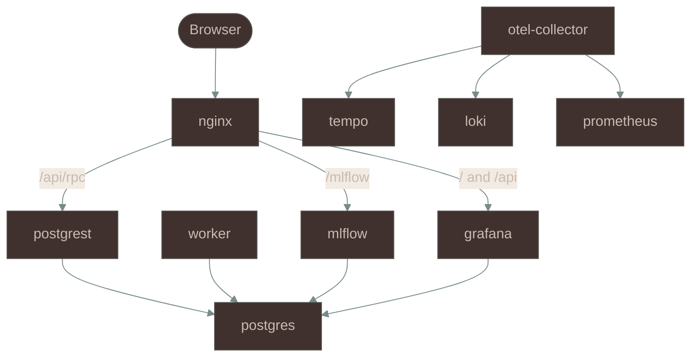

# InvoiceX

Invoice Feature Span eXtractor

Global assignment of schema fields to PDF text-layer spans
Review loop labels retrain the candidate scorers

## Pipeline

| Stage | Input | Output | Invariant | Owner |
|---|---|---|---|---|
| Ingest | SharePoint delta feed every 15 min | one `reextract` job per item with `dedupe_key` | duplicate in-flight jobs dropped by pgqueuer | `queue.py` `azure/sharepoint/` |
| Parse | PDF bytes | frozen `Doc` of pages chars tokens tables keyed by content sha256 | one `pdfplumber.open` in the system | `tokenize.py` `doc.py` |
| Gate | `Doc` | route `degenerate_text_layer` when over 0.30 of chars have zero width | decode skipped and `needs_review` set | `confidence.py` `pipeline.py` |
| Candidates | `Doc` | span rows with bucket geometry anchor and NER features | diversity sampling with max 200 | `views.py` `candidates/` |
| Decode | candidates schema models | `field -> Assignment` of CANDIDATE or NONE | each matrix column used once | `cost.py` `solver.py` `decoder/` |
| Normalize | assignments | typed values per schema normalizer | none | `normalize/` |
| Emit | normalized assignments | contract JSON and review entries | status in PREDICTED ABSTAIN MISSING DEFAULT | `emit/` |
| Persist | contract and candidates | `docs` and `doc_evaluations` rows | `ingest_doc` merge upsert on sha256 | `queue.py` |

Pure functions with no disk I/O in a spawned subprocess per job

## Decode



Matrix is fields by candidates plus one NONE column per field
Off-diagonal NONE cells cost 1e9
Solver is `scipy.optimize.linear_sum_assignment`

| Signal | Source |
|---|---|
| Bucket affinity | `bucket_preference` vs candidate bucket |
| Directional geometry | `anchor_family` keyword positions |
| Text pattern | spaCy entity label vs `normalizer` with negatives amplified |
| Region and spatial bias | `spatial_region` `spatial_bias` `priority_bonus` |
| Document detectors | structural labels colon values cross-page headers city tokens in `adaptive.py` |
| Cross-field | decimal fields with importance 0.9 or more as total and component pairs summing to it within 5 percent cost minus 0.3 |
| Ranker | XGBRanker `rank:pairwise` over 69 `FEATURE_COLUMNS` |

| Rule | Value |
|---|---|
| Ranker cost | `1 - sigmoid(score * w)` with `w` 0.7 or 0.3 in bootstrap and replaces the heuristic cost for fields in the manifest |
| Bootstrap | under 30 positives then cost floor 0.20 and confidence cap 0.8 |
| NONE cost | `none_bias` 0.05 or per-field median times 0.8 optional and 1.5 required when negative |
| Confidence | ranker probability or `0.5 - cost * 0.25` then optional per-field calibration map |
| Review routing | document needs review when any field is under 0.85 |
| Review entry | ABSTAIN MISSING or PREDICTED under 0.85 or without ranker |

Routes `lilt*` only occur in a `WITH_LILT=1` image

| Route | Condition |
|---|---|
| `native` | heuristic and ranker only |
| `lilt_blend` | LiLT CANDIDATE kept and NONE fields filled from heuristic |
| `lilt` | LiLT only after heuristic failure |
| `heuristic_lilt_skipped_large` | over 6000 tokens |
| `heuristic_lilt_error` | LiLT raised |

LiLT is `LiltForTokenClassification` on CPU
LiLT is opt-in with `--build-arg WITH_LILT=1` and the default image runs the native path
Ranker loads from the latest MLflow run

## Schema contract

Table `contract_schema` is append-only with monotonic `version`
Seed file `schema/contract.invoice.seed.json` holds no fields
`SchemaEditorPage` appends through `append_contract_schema`

| Attribute group | Keys |
|---|---|
| Type axes | `base_type` `normalizer` `anchor_family` `bucket_preference` `keyword_proximal` |
| Scoring | `required` `importance` `priority_bonus` `spatial_bias` `anchor_bonus_override` `confidence_threshold` `line_item_field` `is_vendor` `spatial_region` |
| Derivation | `computed` `computed_from` `computed_fn` `default_value` `share_candidate_with` |
| Rules | `cross_field_rules` of `lte` `date_gte` `date_max_gap_days` `eq` |

Pipeline code holds one field-name literal at `emit/_document.py` lines 219 to 220

## Review loop



| Step | Mechanism |
|---|---|
| Queue | `queue_list` lanes ready labeled pending all and sort recent or alphabetical |
| Priority | `priority_score = 0.35 * importance + 0.40 * reason + 0.25 * (1 - abs(2c - 1))` stored per entry and not used for queue order |
| Actions | `submit_label` of `approve` or `correct` with `correct_value` `correct_bbox` or `reject` with `correct_value` or `not_in_document` |
| Storage | `labels` insert only with no dedup on read |
| Rows | latest `doc_evaluations` row per doc and field joined and approve selected 1 others 0 and correct text equal to `correct_value` 1 and reject selected 0 and not_in_document all 0 |
| Trigger | pgqueuer schedule `0 3 * * *` entrypoint `retrain` with concurrency 1 |
| Fit | one XGBRanker on all labeled rows grouped by doc and field |
| Register | MLflow model and `manifest.json` and `model_runs` row and newest run by start time loads and caches by run id |
| Gate | `quality_gate_passed` is written as `not bootstrap` and read nowhere |
| Re-decode | `reextract` enqueued for every labeled doc |

## State

| Table | Holds |
|---|---|
| `docs` | sha256 key and payload of `source_id` `drive_id` `filename` `doc` `candidates` |
| `labels` | doc field action submitted_by payload |
| `doc_evaluations` | per field payload of `priority_score` `reason` `selected_candidate_idx` `mlflow_run_id` `candidates` |
| `contract_schema` | schema versions |
| `model_runs` | MLflow run id and counts |
| `pgqueuer` `pgqueuer_log` `pgqueuer_statistics` `pgqueuer_schedules` | job state |

Not persisted are token ids and DataFrames and PDF bytes
Models live in MLflow with artifacts on volume `/mlartifacts`

## Services



| Service | Profile | Port |
|---|---|---|
| `postgres` `postgrest` `worker` `mlflow` `grafana` | default | none |
| `nginx` | default | 80 |
| `otel-collector` `tempo` `loki` `prometheus` `alertmanager-config` `alertmanager` | `observability` | none |

| Setting | Values | Template default | Effect |
|---|---|---|---|
| `INVOICEX_CONNECTOR_MODE` | `local` `azure` | `local` | `azure` fills unset backends with sharepoint dataverse blob |
| `INVOICEX_DOCUMENT_SOURCE` | `none` `sharepoint` | `none` | ingest and reextract call `SharePointConnector` |
| `INVOICEX_OUTPUT_BACKEND` | `postgres` `dataverse` | `postgres` | no `DataverseConnector` call site in `src` |
| `INVOICEX_PDF_SOURCE` | `local` `http` `sharepoint` | `local` | Go handler reads `<INVOICEX_PDF_LOCAL_DIR>/<sha256>.pdf` or `INVOICEX_PDF_FETCH_URL_TEMPLATE` |

Protocols `DocumentSource` `DataStore` `Ledger` live in `ingest/base.py`
Grafana SSO is `GF_AUTH_AZUREAD_ENABLED` default false
RPC writes: `web_anon` holds EXECUTE on `ingest_doc` `fn_pgqueuer_enqueue` and others, nginx `/api/rpc/` adds no auth, PostgREST has no JWT, restrict port 80 to VPN or private subnet

## Run

```bash
cp .env.template .env
docker compose --env-file .env config -q
docker build --target production -t invoicex:latest .
docker build -t invoicex-mlflow:latest infra/mlflow
docker compose up -d
docker compose --profile observability up -d
```

LiLT opt-in build

```bash
docker build --target production --build-arg WITH_LILT=1 --secret id=gh_token,src=<token-file> --build-arg LILT_RELEASE_TAG=lilt-weights-v1 -t invoicex:latest .
```

Opt-in needs release `lilt-weights-v1` asset `model.safetensors`
Compose has no `build` key so both images must exist
`.env` needs `GRAFANA_ADMIN_PASSWORD`
Deploy targets are `.github/workflows/deploy-vm.yml` and `deploy-azure.yml`
See [docs/deployment-options.md](docs/deployment-options.md)

## Layout

```
src/invoices/
  tokenize.py doc.py views.py   parse and projections
  candidates/                   spans patterns chain
  adaptive.py                   per-document detectors
  cost.py solver.py decoder/    matrix Hungarian heuristic ranker LiLT
  normalize/ emit/              typed values and contract
  schema/ schemas.py            field defs and Pandera
  ranker.py model_loader.py     XGBRanker and MLflow load
  queue.py pipeline.py          worker entry and pipeline
  ingest/ azure/                protocols and adapters
infra/                          init.sql nginx grafana prometheus bicep
grafana-plugins/                labeling app and Go PDF proxy
models/lilt/                    LiLT config tokenizer calibration
```

## License

Proprietary. Licensed under Elastic License 2.0.

See [LICENSE](LICENSE).

---

_Invoice Feature Span eXtractor_

Copyright **Vanessa Beck** 

[github.com/stochastic-sisyphus](https://github.com/stochastic-sisyphus)

[orcid.org/0009-0008-6611-535X](https://orcid.org/0009-0008-6611-535X)
